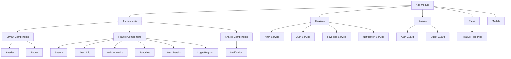

# Artist Search - Frontend

The frontend application for the Artist Search Protal, built with Angular, TypeScript, and Bootstrap.

This portal can be reached on: https://csci571-hw5-nrocikay.wl.r.appspot.com/

Details about the back end can be found in this [repo](https://github.com/Omiikay/Artsy-Backend).

## Overview

This Angular application provides a responsive user interface for searching and exploring artists using the Artsy API. It allows users to browse artist details, view artworks, and manage favorite artists through a modern, intuitive interface.

## Features

- **Artist Search**: Quickly find artists by name
- **Artist Information**: View comprehensive artist details including biography, nationality, and birth/death years
- **Artwork Gallery**: Browse artworks by artist with detailed category information
- **User Authentication**: Register and login functionality with profile management
- **Favorites System**: Save and manage your favorite artists (for authenticated users)
- **Similar Artists**: Discover related artists based on style and influence (for authenticated users)
- **Responsive Design**: Fully optimized for both desktop and mobile devices
- **Notification System**: Interactive notifications for user actions

## Technology Stack

- **Framework**: Angular 19.2
- **Language**: TypeScript
- **UI Framework**: Bootstrap 5
- **State Management**: RxJS
- **HTTP Communication**: Angular HttpClient
- **Styling**: SCSS
- **Icons**: Bootstrap Icons
- **Time Formatting**: Intl.RelativeTimeFormat

## Frontend Architecture



## Project Structure

```
frontend/
├── src/
│   ├── app/
│   │   ├── components/
│   │   │   ├── header/                # Site header with navigation
│   │   │   ├── footer/                # Site footer
│   │   │   ├── search/                # Search form and results
│   │   │   ├── artist-info/           # Artist's infomation
│   │   │   ├── artist-artworks/       # Artist's artworks display
│   │   │   ├── artist-details/       # Artist's details
│   │   │   ├── notification/          # Notification system
│   │   │   ├── login/                 # User login
│   │   │   ├── register/              # User registration
│   │   │   └── favorites/             # User's favorite artists
│   │   │
│   │   ├── services/
│   │   │   ├── artsy.service.ts       # Artsy API communication
│   │   │   ├── auth.service.ts        # Authentication logic
│   │   │   ├── favorites.service.ts   # Favorites management
│   │   │   └── notification.service.ts # Notification management
│   │   │
│   │   ├── models/
│   │   │   ├── artist.model.ts        # Artist data interfaces
│   │   │   ├── artwork.model.ts       # Artwork data interfaces
│   │   │   ├── user.model.ts          # User data interfaces
│   │   │   ├── favorite.model.ts      # Favorite data interfaces
│   │   │   └── notification.model.ts  # Notification data interfaces
│   │   │
│   │   ├── guards/
│   │   │   ├── auth.guard.ts          # Protected route guard
│   │   │   └── guest.guard.ts         # Guest-only route guard
│   │   │
│   │   ├── pipes/
│   │   │   └── relative-time.pipe.ts  # Time formatting pipe
│   │   │
│   │   ├── app.component.ts           # Root component
│   │   ├── app.module.ts              # Main module
│   │   └── app-routing.module.ts      # Application routes
│   │
│   ├── public/                        # Static assets
│   ├── index.html                     # Main HTML file
│   ├── main.ts                        # Application entry point
│   └── styles.scss                    # Global styles
│
├── angular.json                       # Angular configuration
├── package.json                       # Dependencies and scripts
├── proxy.conf.json                    # Development proxy config
├── tsconfig.json                      # TypeScript configuration
└── README.md                          # This file
```

## Installation and Setup

### Prerequisites
- Node.js (v14+)
- npm or yarn
- Backend API server (see backend repository)

### Installation Steps

1. Clone the repository:
   ```
   git clone https://github.com/your-username/artist-search-frontend.git
   cd artist-search-frontend
   ```

2. Install dependencies:
   ```
   npm install
   ```

3. Configure the API endpoint:
   - For development with a local backend, use the provided `proxy.conf.json`
   - For production, update the API URL in the environment files

4. Start the development server:
   ```
   ng serve
   ```

5. Open your browser and navigate to `http://localhost:4200`

## Development Guidelines

### Component Structure
- Components should follow the single responsibility principle
- Use smart/container components for data fetching and dumb/presentational components for UI
- Implement OnPush change detection where appropriate

### State Management
- Use services with RxJS for state management
- Minimize component state; prefer derived state from services
- Use BehaviorSubject for reactive state management

### API Communication
- All API calls should go through the respective services
- Handle loading states and errors consistently
- Use proper typing for all API responses

## API Integration

This frontend communicates with the backend API through the following services:

### Artsy Service
- `searchArtists(query: string)`: Search for artists by name
- `getArtistDetails(artistId: string)`: Get detailed artist information
- `getSimilarArtists(artistId: string)`: Get similar artists
- `getArtworksByArtist(artistId: string)`: Get artist's artworks
- `getArtworkCategories(artworkId: string)`: Get artwork categories

### Auth Service
- `register(credentials)`: Register a new user
- `login(credentials)`: Log in existing user
- `logout()`: Log out current user
- `deleteAccount()`: Delete user account
- `getCurrentUser()`: Get current authenticated user

### Favorites Service
- `getFavorites()`: Get user's favorite artists
- `addFavorite(artistId)`: Add artist to favorites
- `removeFavorite(artistId)`: Remove artist from favorites
- `checkFavorite(artistId)`: Check if artist is in favorites

## Building for Production

To build the application for production:

```
ng build --prod
```

The build artifacts will be stored in the `dist/` directory, ready for deployment.

## Deployment

### Google Cloud Platform

1. Build the application:
   ```
   ng build --prod
   ```

2. Create an `app.yaml` file in the project root:
   ```yaml
   runtime: nodejs22
   
   handlers:
   - url: /(.*\.(js|css|ico|png|jpg|svg|woff|woff2|ttf|eot))$
     static_files: dist/frontend/\1
     upload: dist/frontend/.*\.(js|css|ico|png|jpg|svg|woff|woff2|ttf|eot)$
   
   - url: /.*
     static_files: dist/frontend/index.html
     upload: dist/frontend/index.html
   ```

3. Deploy using gcloud:
   ```
   gcloud app deploy
   ```
